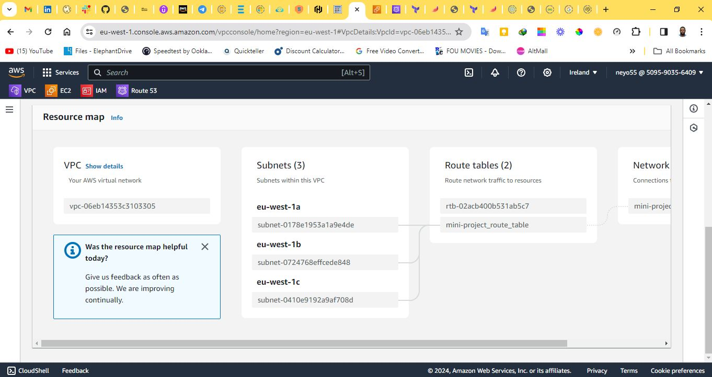
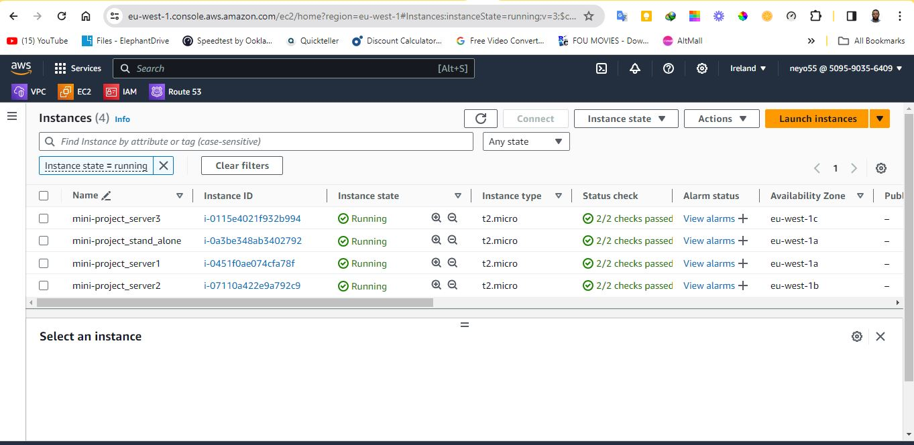
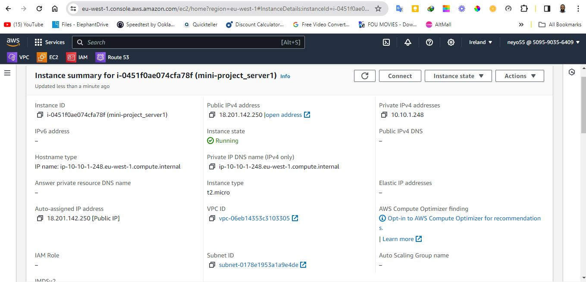
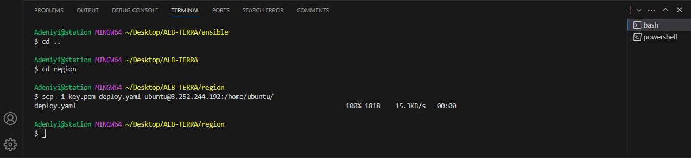
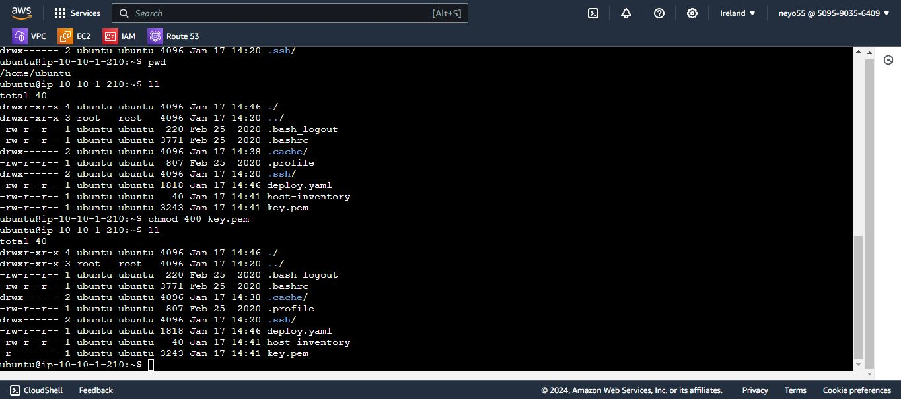
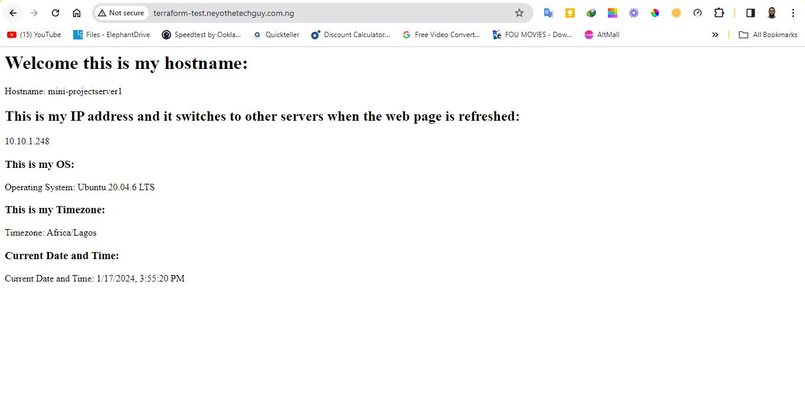
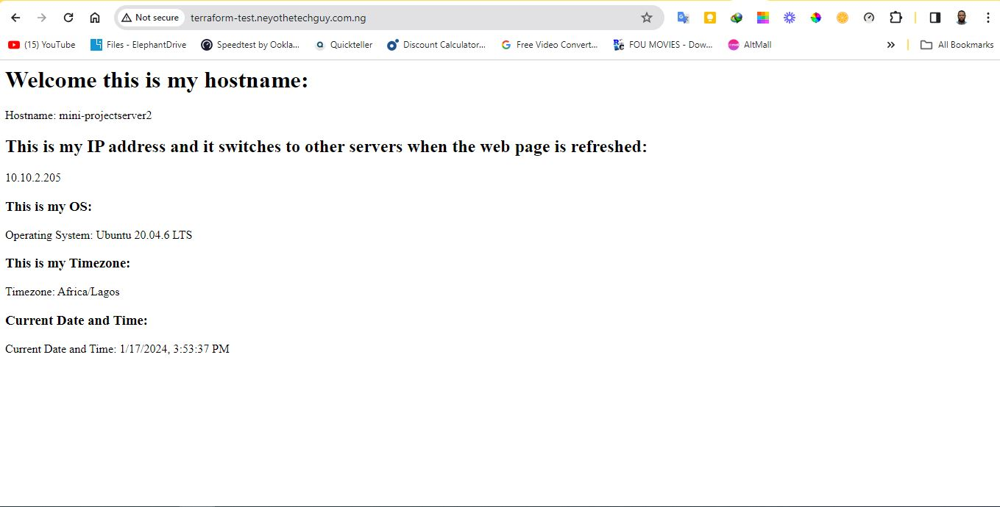
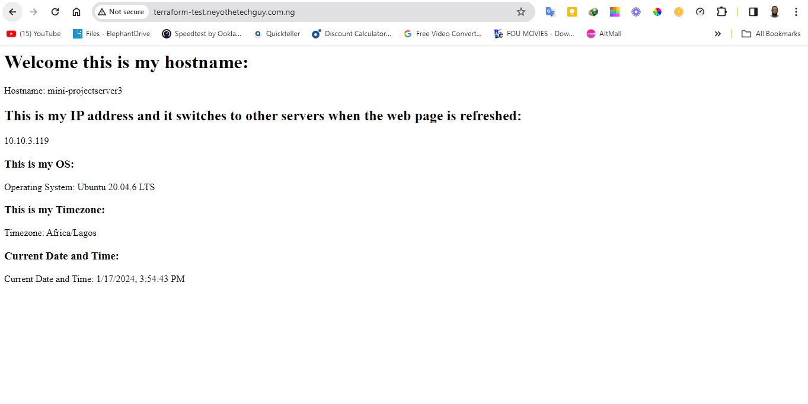

# Terraform Project Documentation

## Table of Contents
- [Terraform Project Documentation](#terraform-project-documentation)
  - [Table of Contents](#table-of-contents)
  - [1. Introduction](#1-introduction)
  - [2. Prerequisites](#2-prerequisites)
  - [3. Directory Structure](#3-directory-structure)
  - [4. VPC Module](#4-vpc-module)
    - [Vpc modules configuration](#vpc-modules-configuration)
    - [vpc modules outputs](#vpc-modules-outputs)
  - [5. INSTANCE Module](#5-instance-module)
    - [ec2 module configuration](#ec2-module-configuration)
    - [ec2 module outputs](#ec2-module-outputs)
  - [6. ALB Module](#6-alb-module)
    - [alb modules configuration](#alb-modules-configuration)
    - [alb modules outputs](#alb-modules-outputs)
  - [7. Ansible](#7-ansible)
  - [8. Region](#8-region)
  - [9. Best Practices](#9-best-practices)
  - [9. Testing](#9-testing)
    - [This is the VPC created in eu-west-1](#this-is-the-vpc-created-in-eu-west-1)
    - [These are the instances created in eu-west-1](#these-are-the-instances-created-in-eu-west-1)
      - [The instances are public instances in each availability zone (eu-west-1a, eu-west-1b and eu-west-1c)](#the-instances-are-public-instances-in-each-availability-zone-eu-west-1a-eu-west-1b-and-eu-west-1c)
    - [This is the output information generated in eu-west-1](#this-is-the-output-information-generated-in-eu-west-1)
      - [The hostname, instance ids, public and private ip address, security group id and subnet id](#the-hostname-instance-ids-public-and-private-ip-address-security-group-id-and-subnet-id)
    - [This is the copy proccess from my local system to the stand alone instance.](#this-is-the-copy-proccess-from-my-local-system-to-the-stand-alone-instance)
    - [Using the scp command to copy files one after the other from my local system to the AWS console.](#using-the-scp-command-to-copy-files-one-after-the-other-from-my-local-system-to-the-aws-console)
      - [This is the copied files (deploy.yaml, key.pem, host-inventory) listed in the home/ubuntu direcotry of my stand alone instance.](#this-is-the-copied-files-deployyaml-keypem-host-inventory-listed-in-the-homeubuntu-direcotry-of-my-stand-alone-instance)
    - [This is the copied files (deploy.yaml, key.pem, host-inventory) listed in the home/ubuntu direcotry of my stand alone instance.](#this-is-the-copied-files-deployyaml-keypem-host-inventory-listed-in-the-homeubuntu-direcotry-of-my-stand-alone-instance-1)
      - [The availability zones, instance ids, public ip addresses, security group id and subnet ids](#the-availability-zones-instance-ids-public-ip-addresses-security-group-id-and-subnet-ids)
  - [10. Usage](#10-usage)
  - [11. Contributing](#11-contributing)
  - [12. References](#12-references)
  - [13. Conclusion](#13-conclusion)

## 1. Introduction

This documentation provides an overview and detailed information about the Terraform and Ansible project designed to deploy and manage infrastructure on AWS. The project is organized into modules for VPC creation, security groups configuration, EC2 instances provisioning and ALB configuration, there is also an ansible playbook to install Apache, set timezone to Africa/Lagos and displays a simple HTML page that displays the content to clearly identify on all 3 EC2 instances, while this project also involves setting up a domain using Route53 to display the content of the instances when you visit (terraform-test.neyothetechguy.com.ng). 
There is a stand alone instance as well, that uses the public IP of the 3 instances generated in the host-inventory file to install apache, set time zone on the 3 EC2 instances. The stand alone instance is created in one availability zone with one of the 3 instance. Ansible is installed on the stand alone instance to enable it run playbooks.
The aim of this project is to create a simple web server using EC2 instances, Application Load and Rout53 for the domain.

## 2. Prerequisites

Ensure the following prerequisites are met before using this Terraform project:

- AWS account with appropriate credentials.
- AWS CLI installed and configured.
- Terraform installed on the local machine.
- Ansible installed on the stand alone instance

## 3. Directory Structure

```plaintext
--eu-west-1-lb
    --provider.tf
    --main.tf
    --variables.tf
    --terraform.tfvars
--ansible
   --deploy.yaml
--modules
   --vpc
      --main.tf
      --variables.tf
      --outputs.tf
  --ec2
     --main.tf
     --variables.tf
     --outputs.tf
 --alb
    --main.tf
    --variables.tf
    --output.tf
```
- **`modules`**: Contains individual modules for VPC (Network) and ec2 (instance).
- **`region`**: Includes the location of where the installation is done or configured (availability zone).
- **`terraform.tfvars`**: Terraform variable files for defining specific variables.
- **`outputs`**: Includes information needed and which is not known until after applying the plan.
- **`deploy.yaml`**: This playbook includes the configuration of installing apache, setting time zone by using the ip addresses of the instance in host-inventory file.

## 4. VPC Module

### Vpc modules configuration

The VPC module (`modules/vpc`) is responsible for creating a Virtual Private Cloud on AWS. It includes the following key components:

- VPC
- Subnet
- Internet Gateway
- Route Table
- Route Table Association

[View VPC Module Configuration](/modules/vpc-network/main.tf)

### vpc modules outputs

- `subnet_id`: ID of the subnet.
- `security_group_id`: ID of the security group.
- `availability_zones`: Availability zone of the Region.

[View VPC Module Outputs](/modules/vpc-network/outputs.tf)

## 5. INSTANCE Module

### ec2 module configuration

The Instance module (`modules/ec2`) provisions EC2 instance in the subnets. It includes:

- Ubuntu-focal-20.04 LTS AMI
- Key Pair Generation
- Security Group
- Standalone instance

[View Instance Module Configuration](/modules/ec2/main.tf)

### ec2 module outputs

- `instance_ids`: ID of the instances.
- `public_ip_addresses`: Public IP address of the instance.

[View EC2 Module Outputs](/modules/ec2/outputs.tf)

## 6. ALB Module

### alb modules configuration

The ALB module (`modules/alb`) is responsible for creating the application load balancer that randomly switches the ec2 instance when called upon. It includes the following key components:

- Load balancer
- Target group
- Target group attachment 
- Listener
- Route53 
- Route53 record

[View ALB Module Configuration](/modules/alb/main.tf)

### alb modules outputs
[View ALB Module Outputs](/modules/alb/outputs.tf)

- `load_balancer_dns_name`: ID of the subnet.
- `target_group_arn`: ID of the security group.
- `my_subdomain_1`: Availability zone of the Region.

## 7. Ansible
[View Ansible Playbook Configuration](/ansible/deploy.yaml)
- The ansible playbook uses the host-inventory file exported to install Apache on the instances using their public IPs.
 - The ansible playbook sets the time zone to Africa/Lagos.
- The ansible playbook it also lets the instances display a simple HTML page.

## 8. Region
- Configuration for the region eu-west-1.

## 9. Best Practices

- Used consistent naming conventions for resources.
- Added comments to explain resource purposes and configurations.
- Tested configurations many times before affirming to this.
- Used Terraform modules to organize and reuse configurations.
- Used folders to organize Terraform environments.
- Used variables to define specific configurations.
- Used outputs to reference resource attributes.

## 9. Testing

Testing was conducted in the region. The following tests were performed:

- **VPC**: Created a VPC with 1 subnet in each availability zone.

### This is the VPC created in eu-west-1



### These are the instances created in eu-west-1
#### The instances are public instances in each availability zone (eu-west-1a, eu-west-1b and eu-west-1c)



### This is the output information generated in eu-west-1
#### The hostname, instance ids, public and private ip address, security group id and subnet id




### This is the copy proccess from my local system to the stand alone instance. 



### Using the scp command to copy files one after the other from my local system to the AWS console.
#### This is the copied files (deploy.yaml, key.pem, host-inventory) listed in the home/ubuntu direcotry of my stand alone instance.



### This is the copied files (deploy.yaml, key.pem, host-inventory) listed in the home/ubuntu direcotry of my stand alone instance.
#### The availability zones, instance ids, public ip addresses, security group id and subnet ids






## 10. Usage

To use this project:

1. Clone the project's GitHub repository: [GitHub Repository Link](https://github.com/neyo55/3rd-semester-lms-mini-project).

2. Ensure you have terraform installed on your local machine. to install terraform follow the instructions on this link: [Terraform Installation](https://learn.hashicorp.com/tutorials/terraform/install-cli).

3. Ensure you have AWS CLI installed and configured on your local machine. to install AWS CLI follow the instructions on this link: [AWS CLI Installation](https://docs.aws.amazon.com/cli/latest/userguide/cli-chap-install.html).

4. Ensure you have Ansible installed and configured on your Ubuntu machine. to install Ansible follow the instructions on this link: [Ansible Installation][def].

5. Ensure you have an AWS account with appropriate credentials.

6. Navigate to the project directory.

7. change the values of the variables in the `terraform.tfvars` file to match your environment.

8. change the values of the provider configuration in the `region/provider.tf` file to match your environment.


8. To run this code navigate to the region directory and type `terraform init`.
 
9. The next is to run `terraform plan` to plan your code and to know what is going to be deployed.

10. If everything looks good then proceed to deploy by typing `terraform apply` after successful deployment the output details is shown.
10. Go to AWS console console and connect to the stand alone instance where the ansible configuration will be done.

11. the host-inventory, deploy.yaml and ssh key should be copied to the stand alone server from the local system using scp command.
    "scp -i key.pem deploy.yaml host-inventory ubuntu@ip of the stand alone instance:/home/ubuntu/"

12. The stand alone instance was used to deploy the ansible playbook (deploy.yaml) on the 3 instances using "ansible-playbook -i host-inventory --key-file=./key.pem deploy.yaml" to perform the required task.

13. After installation and configuration copy the load balancer DNS to a browser to access the web page of each instance.

14. further more, the registered domain name is also used to access the instances when you type: terraform-test.neyothetechguy.com ng and it changes the instances as you fresh the web browser page.

15. Run `terraform destroy --auto-approve` to destroy the Terraform configurations that was previously applied.

## 11. Contributing

Contributions to this project are highly welcomed. If you would like to contribute, follow these steps:

1. Fork the project's GitHub repository.

2. Create a new branch for your bug fix.

3. Make your changes and commit them to your branch.

4. Submit a pull request to the main repository for review and integration.

## 12. References

- [Terraform Documentation](https://www.terraform.io/docs/index.html)
- [Terraform AWS Provider Documentation](https://registry.terraform.io/providers/hashicorp/aws/latest/docs)
- [Terraform AWS Modules](https://registry.terraform.io/modules/terraform-aws-modules)
- [Terraform Best Practices](https://www.terraform-best-practices.com/)
- [AWS CLI Documentation](https://docs.aws.amazon.com/cli/index.html)
- [AWS CLI Configuration](https://docs.aws.amazon.com/cli/latest/userguide/cli-configure-quickstart.html)
- [AWS CLI Credentials](https://docs.aws.amazon.com/cli/latest/userguide/cli-configure-files.html)
- [Ansible Installation](https://docs.ansible.com/ansible/latest/installation_guide/intro_installation.html#pipx-install)

## 13. Conclusion

This documentation provides a comprehensive guide to the Terraform project structure, configurations, and best practices.

Thank you for using this project and good luck!


